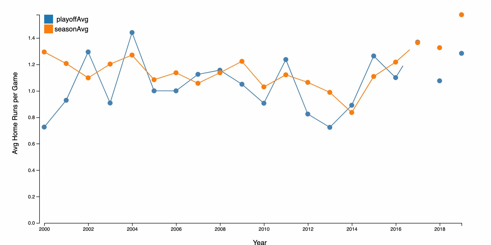
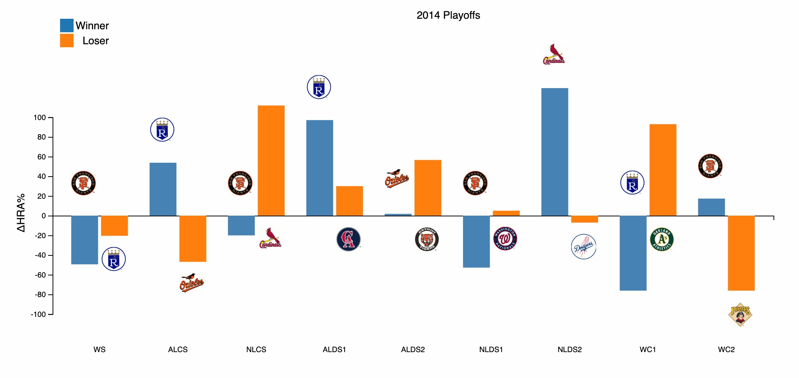

## [Home Run Hitters](https://homers-smith.herokuapp.com)

### Background & Overview

As home runs continue to to rise in the MLB, there's been debate as to what this root cause is. Home run hitters is a data
visulation project designed for the user to take a deep dive into the world of baseball and this rapidly growing statistic.
Users can view the home run averages of teams in the postseason in comparison to their performance in the regular season, and
break down each playoff series for any given year on the chart. 

### List of Technologies and Libraries
 * D3 (v5)
 * Javascript
 
### Technical Implementation

Custom Graph Animations:


```
data = d3.nest()
    .key(d => d.year )
    .sortKeys(d3.ascending)
    .rollup(v => {  
      return {
        Playoff: ((d3.sum(v, d => d.serieshr2count) + d3.sum(v, d => d.serieshr1count)) / 
                  (d3.sum(v, d => d.gamesInSeries) * 2)),
        Season: (d3.mean(v, d => d.seasonhr2count) + d3.mean(v, d => d.seasonhr1count))/(162*2)
      } 
    })
    .entries(data)
  
  const parseTime = d3.timeParse("%Y");
  
  data.forEach(d => {
    d.key = parseTime(d.key)
    d.value.Playoff = +d.value.Playoff
  });

  x.domain(d3.extent(data, d => d.key));
  y.domain([0, d3.max(data, d => d.value.Season)]);
```

Secondary graphs for each data point on main display:


```
data = d3.nest()
    .key(d => d.year)
    .sortKeys(d3.ascending)
    .rollup(v => {
      let arr = [];
      v.forEach(series => {
        arr.push({
          series: series.series.toUpperCase(),
          t1Val: ((series.serieshrt1avg - series.seasonhrt1avg)/series.seasonhrt1avg) * 100,
          t2Val: ((series.serieshrt2avg - series.seasonhrt2avg)/series.seasonhrt2avg) * 100,
          t1Name: series.t1,
          t2Name: series.t2,
          year: series.year
        })
      })
      return arr
    })
    .entries(data)

    const parseTime = d3.timeParse("%Y");
                        data.forEach(d => {
                          d.key = parseTime(d.key)
    });

const filtered = data.filter(seriesYear => ((Date.parse(seriesYear.key) === Date.parse(year))));
```

### Future Features
  * User's can select other batting statistics in compare their rate in the regular season versus postseason
  * Playoff series breakdown, with individual statistics
